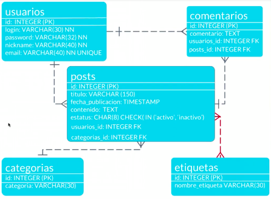
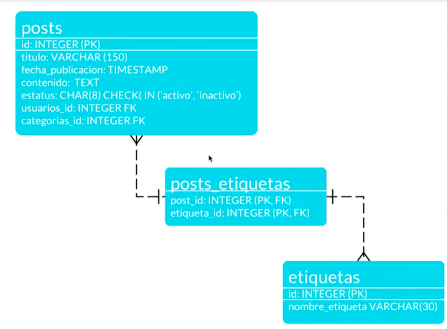
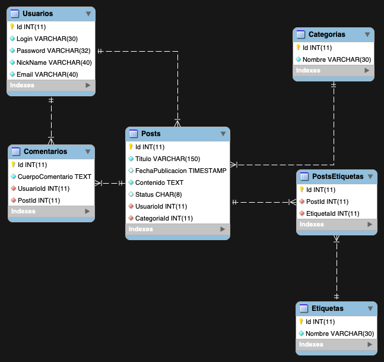

[:arrow_left: Volver al inicio](../README.md)


## Configuración del entorno de trabajo con Docker
Desde la terminal de comandos, se debe acceder al directorio docker contenido aquí, y para generar la imagen a utilizar por el contenedor se efectúa de la siguiente forma:
```bash
cd docker
docker build -t mysql:platzi .
```
Para correr el contenedor a partir de la imagen `mysql:platzi`, se debe correr el siguiente comando:
```bash
docker-compose up -d
```
Para bajar el contenedor (_importante! se borran los datos al salir_):
```bash
docker-compose down
```
## Prácticas de Clases
### Data Definition Language
Comprende los comandos estanadarizados de SQL que definen una base de datos:
* CREATE
* ALTER
* DROP
### Data Manipulation Language
Son aquellos comandos del estándar SQL para la manipulación de los datos:
* SELECT
* INSERT
* UPDATE
* DELETE
### Proyecto PlatziBlog
El curso propone realizar un proyecto de un Blog, según el siguiente análisis de Diagrama de Entidad-Relación de Tablas Independientes y Dependietes con esquema de relación uno a uno o uno a muchos:



A su vez se presenta el escenario de las Tablas Transitivas que sirven de nexo para lograr relaciones de mucho a muchos:



Al finalizar el proyecto DDL de PlatziBlog, se puede obtener el Diagrama Entidad Relacion provisto por la funciionalidad de ingeniería inversa de MySQL Workbench:

